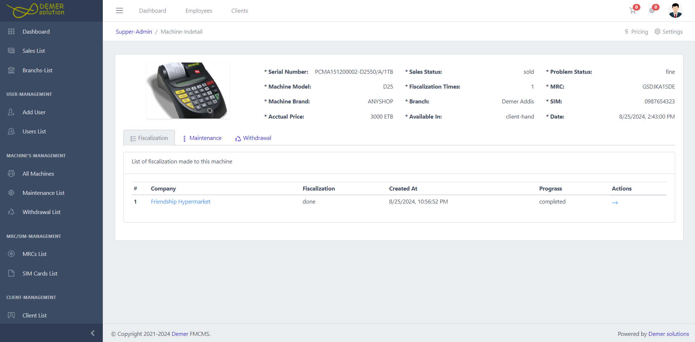

## Fiscal Machine Controlling and Management System (FMCMS)

[](https://youtu.be/lUvN1EfmIU0?si=Zpylsx8HdbOezd36)

<!-- https://user-images.githubusercontent.com/60927507/149324901-e408c4c6-33c2-4f9b-99ed-931dfb77c134.png -->

## Getting started

### 1. Clone the project

```
git clone https://github.com/NegasiHaile/FMCMS
```

### 2. Install server dependecies

To install the backend project dependencies run the following command in the root project.

```
npm install .
```

### 3. Install client dependencies

To install the the React project dependencies fellow the following two steps.

```
cd client
```

```
npm install .
```

### 4. Run the projects

Run this in the root project

```
npm run dev
```

## System users

This system features 10 type of user roles with their own privileges.

1. Super Admin (Who initiates the system)
2. Main Store (Manage overall machines)
3. Branch Admin (Control branch activities)
4. Operation Manager (Manage branch sales operations)
5. Branch Store (Manage branch machines)
6. Sales (Sale machines and Prepare sales documentation)
7. Machine Controller (Manage client’s machines)
8. Technician (Macke maintenance and fiscalization)
9. Customer Service (Deliver machines)
10. Client (Machine buyers)

## Subsystems

1. Machine Sale
2. Machine Maintenance
3. Machine withdrawal
4. Mailing system

## System features

1. Create Branch
2. Add employee (Register new employee and push to one of the branches).
3. Add (Register) new imported Machines, MRC, and SIM Details in the main branch.
4. Distribute these registered Machines, MRCs, and SIM cards from the main branch to sub-branches.
5. Accept (confirm) new arrival machines and SIM cards in sub-branch distributed from the main branch.
6. Assign (attach) MRC and SIM to a machine
7. Add clients (business owners) details
8. Register the client's business details.
9. Assign (attach) machines to the business (Prepare sales document).
10. Request the sales document to the Operational manager for approval.
11. Approve the sales documentation and request to the branch store for machine readiness
12. Assign a technician to the machine who can make the fiscalization.
13. Request to a technician for fiscalization
14. Request fiscalized machine back to machine controller
15. Request customer service for delivery
16. Confirm delivery and print delivery note (Sales endpoint)
17. Receive client machine
18. Request received machine to machine controller for:
    a. Maintenance
    b. Temporary Store
    c. Withdrawal

A. Maintenance

- Assign Technician
- Request to technician for maintenance
- Request maintained machine back to machine controller
- Request to customer service for delivery
- Confirm machine delivery and print delivery (make an agreement with business contact person) (Maintenance endpoint)

B. Temporary Store

- Request to branch store for machine temporary storing.
- Request back to machine controller for delivery
- Request to customer service for delivery
- Confirm machine delivery and print delivery note (Make an agreement with the business contact person)
  (Temporary store endpoint)

C. Withdrawal

- Request to machine controller to submit the machine
- Request machine to branch store for restoring
- Confirm restore machine
  (Withdrawal endpoint)

### Mail System

      1, Add email
      2, Verify email
      3, Make the email primary
      4, Make the email openable from any app
      3, Close the reCAPTCHA system

## Roles

1. Super Admin

- Manage Branches
  • Create, update branch
  • See branches detail, Dashboard and Activities.
- Manage users Account
  • Add employee (user) and push to sub-branch
  • Activates and Deactivates user account
- Manages system email: - When a user `forget password` a password reset link must be sent to the user email. And there should be an email used to send the link. Then the following privileges are under this user: -
  • Add new email
  • Verify email
  • Make email as a primary email of the system
  • Change primary email of the system

2. Main Store

- Manages Machine (
  o Register,
  o Update
  o And delete new imported machines
  o Distribute machines to sub-branches)
- Manages SIM Cards (
  o Register,
  o Update
  o And delete new imported SIM cards
  o Distribute SIM cards to sub-branches
- Manages MRC (
  o Register,
  o Update
  o And delete new imported SIM cards
  o Distribute SIM cards to sub-branches

3. Branch Admin

- Control branch activities
- Activate and deactivate branch users

4. Operational Department

- Approvement of sales (Read the sales documentation and approve sales)
- See branch sales and maintenance analysis

5. Branch Store

- Accept new arrivals (Machine and SIM cards)
- Attach SIM card and MRC with machines
- Request machine for fiscalization
- Accept restore machines
- See machines report (Sold, Unsold, and Processing)

6. Sales

- Create an account for client
- Encode business details of the client
- Attach machines to the business
- Request to operational manager for sales approvement
- See yearly and monthly branch sales report

7. Machine Controller

- Control Client Machines
  o Control machines came for maintenance and requested them to technician for maintenance.
  o Control machines came for withdrawal and request to branch store for restoring.
  o Control machines which are ready for delivery and request them to customer service for delivery

8. Technician

- Fiscalize the machine and request to the machine controller
- Receive client machines come for maintenance
- Make maintenance to the machines and request back for the machine controller

9. Customer Service

- Assign technician to machine for fiscalization and maintenance
- Confirm machine delivery
- Print machine delivery notes and make agreements with the business contact person (machine owner).
